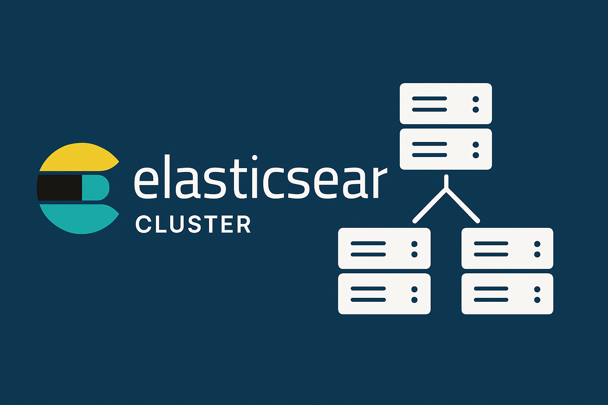

    

    

    
    

> If you enjoy the project, please consider giving us a GitHub star ⭐️. Thank you!

## Sponsors

If you want to support our project and help us grow it, you can [become a sponsor on GitHub](https://github.com/sponsors/coozila).

  

# Elasticsearch Cluster

## Coozila! Docker Package APP for Elasticsearch Cluster with Kibana

The **Coozila! Package for Elasticsearch Cluster** integrates **Elasticsearch** and **Kibana**, delivering a powerful solution tailored for modern applications. Designed to maximize scalability and performance, this package empowers developers to deploy a distributed data storage and visualization layer effortlessly, alleviating database load while significantly improving response times.

### Why Choose Coozila?

- **Simplified Scalability**: Deploy a highly efficient distributed cluster using pre-configured Docker packages, reducing complexity and ensuring faster response times.
- **Intelligent Data Visualization**: Take advantage of Kibana's advanced capabilities for visualizing and analyzing data stored in Elasticsearch, enabling better insights and decision-making.
- **Blazing-Fast Performance**: With Elasticsearch at its core, Coozila! offers a high-speed, fault-tolerant data storage system optimized for high-demand environments.
- **Dynamic Configuration**: Easily manage and scale your data infrastructure with live updates, ensuring zero downtime.
- **Rich Analytics**: Implement advanced analytics and monitoring features to enhance data retrieval efficiency and application performance.

### Documentation

- [Quick Start Guide](docs/README.md)

### Core Features

- **High Availability**: Ensure reliable data storage with integrated failover and replication mechanisms, even during node failures.
- **Optimized Data Retrieval**: Leverage Kibana to create visualizations and dashboards that provide insights into your data, achieving better resource management.
- **Advanced Querying**: Utilize Elasticsearch's powerful querying capabilities to retrieve and analyze data efficiently.
- **Rich Monitoring Tools**: Access detailed statistics and debugging commands for complete visibility into data performance.
- **Security First**: Utilize built-in SSL support and IPv6 compatibility to secure data in transit.
- **Multi-Threaded Architecture**: Harness the power of multi-core systems for efficient request handling.

### Easy Deployment

The package comes with pre-configured Docker containers and a straightforward setup process, enabling developers to get started quickly. With Coozila!, you can build a scalable, reliable data infrastructure in minutes.

### Who Is It For?

- **Developers**: Aiming to enhance application performance through efficient data management and visualization strategies.
- **Organizations**: Looking to reduce database overhead while achieving faster response times with minimal complexity.
- **Teams**: In need of a robust and scalable data solution for web applications, APIs, or data-intensive systems.

#### Specific Use Cases:

- **Web Developers**: Creating high-traffic websites or APIs that require efficient data retrieval.
- **E-Commerce Platforms**: Managing real-time product availability and pricing data.
- **Streaming Services**: Overseeing user preferences, recommendations, and playback data.
- **Enterprises**: Running data-intensive applications that require high availability and responsiveness.

Elevate your application's performance with the **Coozila! Elasticsearch Cluster**, a powerful solution that combines the reliability of Elasticsearch with the visualization capabilities of Kibana. Whether you're managing high-demand environments or planning for future growth, Coozila! is your ideal package for effortless deployment and unparalleled efficiency.

## Contributing

We welcome contributions to this project! Please refer to our [Contributing Guidelines](CONTRIBUTING.md) for detailed instructions on how to contribute.

For questions or contributions, feel free to contact the **Coozila! Labs** at [labs@coozila.com](mailto:labs@coozila.com).

### Code of Conduct

We are committed to fostering an inclusive and respectful environment. Please review our [Contributor Code of Conduct](CODE_OF_CONDUCT.md) for guidelines on acceptable behavior.

## References and Credits

We extend our gratitude to the creators and maintainers of the tools and technologies that power this project. Below are some key references:

### Websites:

- [Docker Hub Official Website](https://hub.docker.com/)
- [Elasticsearch Official Website](https://www.elasticsearch.io/)
- [Coozila! AGI Official Website](https://agi.coozila.com/)
- [Coozila! AGI Developer API](https://agi.coozila.com/api/docs/)
- [Coozila! Official Website](https://www.coozila.com/)
- [GitHub Official Website](https://github.com/)

### GitHub:

- [Elasticsearch GitHub Repository](https://github.com/elastic/elasticsearch)
- [Kibana GitHub Repository](https://github.com/elastic/kibana)
- [Coozila! GitHub Main Repository](https://github.com/coozila)

### AI Contributions:

We would also like to acknowledge **Hypatia AI**, a project of Coozila! AGI, for providing intelligent assistance and support in developing this documentation and enhancing the overall project experience.

### What is Elasticsearch?

Elasticsearch is a distributed database that provides a powerful, scalable, and fault-tolerant solution designed for high availability and performance. It is optimized for use cases that require efficient data retrieval and storage, making it an ideal complement to data visualization tools in clustered environments.

### What is Kibana?

Kibana is a powerful data visualization tool that works in conjunction with Elasticsearch. It provides a user-friendly interface for searching, analyzing, and visualizing data stored in Elasticsearch. Kibana allows users to create interactive dashboards, generate reports, and gain insights from their data through various visualization options, such as charts, graphs, and maps.

### Overview of Elasticsearch and Kibana

Elasticsearch and Kibana work together to provide a robust data storage and visualization solution for high-demand applications. By utilizing Elasticsearch for efficient data retrieval and storage, applications can significantly reduce response times and database load. Kibana enhances this by offering powerful visualization capabilities, enabling users to analyze and interpret their data effectively.

## Project Structure

- **Docker Compose Configuration**: Defines services for Elasticsearch and Kibana.
- **Networks**: Configured for application services.
- **Volumes**: Data persistence for Elasticsearch instances.

## Services

### Elasticsearch Servers

Three instances of Elasticsearch are configured:

1. **es1**
2. **es2**
3. **es3**

Each instance:
- Uses the image `docker.elastic.co/elasticsearch/elasticsearch:8.17.0`.
- Sets memory lock limits.
- Maps local port `9200` to container ports `9200`, `9200`, and `9200`.
- Persists data in separate volumes.

### Usage:
1. **Start the services**: Run `docker-compose up -d` to start the Elasticsearch instances.
2. **Point your application**: Configure your application to connect to the Elasticsearch instances for data retrieval and analysis.

### Kibana

- Image `docker.elastic.co/kibana/kibana:8.17.0`.
- Links to the three Elasticsearch instances.
- Command configuration for data visualization operations.

## Installation Assistance

If you would like assistance with the installation of this product, please contact **Coozila! Labs** at [labs@coozila.com](mailto:labs@coozila.com). Our team is ready to help you with the installation process and ensure a smooth setup.

Based on the size and complexity of your project, we will provide you with a tailored pricing quote.

For purchasing the installation, please visit the following link: [Coozila Docker Package App for Memcached](https://www.coozila.com/plus/view-product/coozila-docker-package-app-for-memcached).

You can also check out the official Coozila! Labs page for more information: [Coozila! Labs](https://www.coozila.com/plus/view-organization-profile/coozila-labs).

For any inquiries, feel free to reach out through our contact page: [Contact Coozila!](https://www.coozila.com/plus/contact).

### After Purchase Notes

After your purchase, please provide the following information via email:

- Server login credentials
- An SSH key for secure access
- Details about the project you wish to integrate

## Additional Documentation

For more details, please refer to the main repository: 

- [Coozila! Apps](https://github.com/coozila/apps).
- [Kibana](https://github.com/elastic/kibana)
- [Elasticsearch](https://github.com/elastic/elasticsearch)

## Trademarks and Copyright

This software listing is packaged by Coozila!. All trademarks mentioned are the property of their respective owners, and their use does not imply any affiliation or endorsement.

### Copyright

Copyright (C) 2009 - 2025 Coozila! Licensed under the MIT License.

### Licenses

- **Coozila!**: [MIT License](https://github.com/coozila/elasticsearch-cluster/blob/dev/LICENSE)
- **Elasticsearch**: [Elasticsearch License](https://github.com/elastic/elasticsearch/blob/main/LICENSE.md)
- **Kibana**: [Kibana License](https://github.com/elastic/kibana/blob/main/LICENSE)

## Disclaimer

This product is provided "as is," without any guarantees or warranties regarding its functionality, performance, or reliability. By using this product, you acknowledge that you do so at your own risk. Coozila! and its contributors are not liable for any issues, damages, or losses that may arise from the use of this product. We recommend thoroughly testing the product in your own environment before deploying it in a production setting.

Happy coding!
